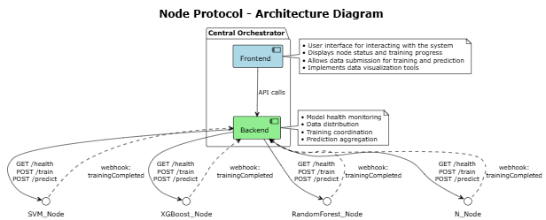
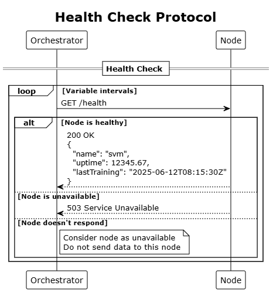
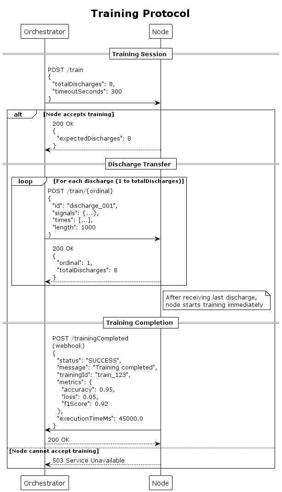
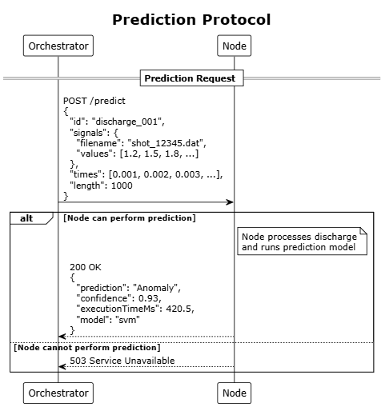

# outlier_protocol

1. [outlier\_protocol](#outlier_protocol)
   1. [Introduction](#introduction)
   2. [Protocol description](#protocol-description)
      1. [Health](#health)
      2. [Train](#train)
      3. [Predict](#predict)

## Introduction

This project describes how does the orchestrator interacts with nodes. The [protocol](protocol.yaml) is a OpenApi based protocol.

The general architecture of the system is described below.

Any node must implement this [protocol](protocol.yaml) to be compatible with the orchestrator.

## Protocol description

The `outlier_protocol` is a simple protocol based on http messages that are grouped into 3 main categroies: *health*, *train* and *predict*. Each group is described below.

### Health 

Models must implement the `/health` endpoint. The orchestrator will send a `get` message at a variable time. If the model does not answer, orchestrator must consider the model as unavailable, and data must not be sent to this model.

### Train 

With these group of endpoints, it is described how the models will be trained in order to acquire data for disruption prediction.

Protocol begins with a `post` message to the `/train` model endpoint that contains the number of discharges that will be sent to the models. Models that want to accept the training, answer with a 200 response. Then the orchestrator sends, one by one, the training discharges. After a discharge is received, models must acknowledge it. When all discharges are sent, models shall start the training.

When the training is done, models must inform the orchestrator, to the `/trainingCompleted` orchestrator endpoint. Each model will inform about the training stats that has achieved.

### Predict

Orchestrator will send a `post` message to the `/predict` endpoint of every model in order to start a prediction. Models must answer with the predicted value.

